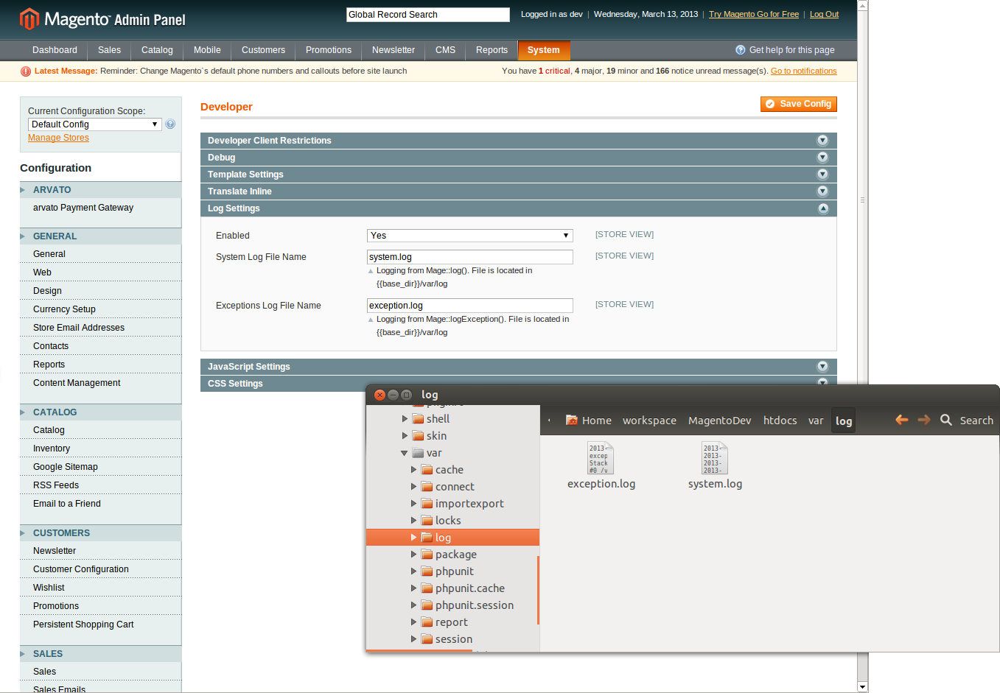
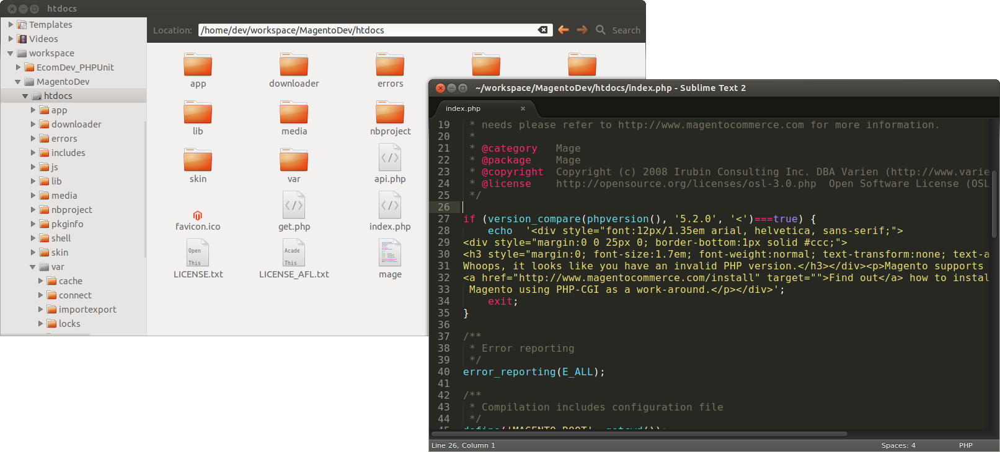
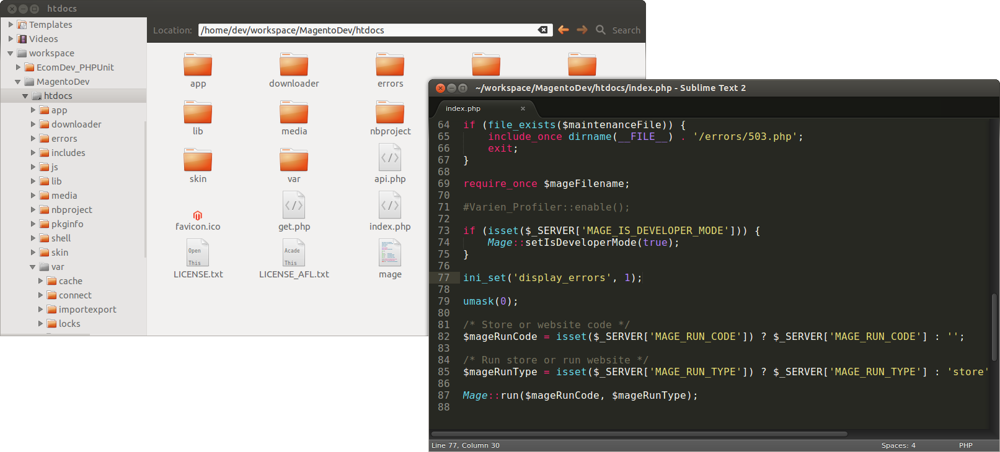
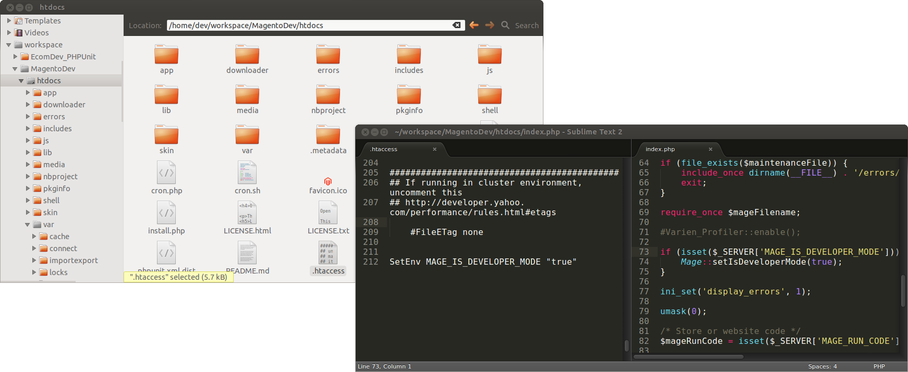

# Debugging Magento

Configuration tweaks to debug your Magento development environment.

## Enable Exception Reporting

Magento does not display exceptions by default. To enable exception printing in Magento you only have rename the file "errors/local.xml.sample" file in your Magento folder to
"errors/local.xml".

<!-- language: lang-sh -->

	cd /<Magento-htdocs-folder>/errors
	mv local.xml.sample local.xml

Links:

- [Eric Mitchell: Enabling Exception Reporting in Magento](http://ekmitchell.com/2010/11/16/enabling-exception-reporting-in-magento/)

## Enable Logging

Goto `"Magento Admin Panel" > System > Configuration > Advanced > Log Settings` and set the log setting "Enabled" to "Yes".

Once you have enabled logging you will find an exception and a system log in your `<Magento-htdocs-folder>/var/log` folder.

<!-- language: lang-sh -->

	tail -f <Magento-htdocs-folder>/var/log/system.log

## Set the PHP Error Reporting Level and make sure errors are displayed

Make sure your [PHP error reporting level](http://php.net/manual/de/function.error-reporting.php) is set to `E_ALL` in your index.php - this will make sure no errors are swollowed by the system.

<!-- langauge: lang-php -->

	error_reporting(E_ALL);

And also that the PHP's `display_errors` flag is set to true:

<!-- langauge: lang-php -->

	ini_set('display_errors', 1);

## Enable Magentos Developer Mode

When you turn on Magento's [developer mode](http://alanstorm.com/magento_exception_handling_developer_mode) you will get more detailed error messages and stack traces.

Enable Developer Mode in your .htaccess

	SetEnv MAGE_IS_DEVELOPER_MODE "true"

**Links**

- [Alan Storm - PHP Error Handling and Magento Developer Mode](http://alanstorm.com/magento_exception_handling_developer_mode)
- [Alan Storm - Magento Development Environment](http://alanstorm.com/magento_log_and_developer_mode)
- [Configuring Magento for Development / Debug Mode](http://www.blog.magepsycho.com/configuring-magento-for-development-debug-mode/)

---

language: en
date: 2013-02-07
tags: Magento, Debugging