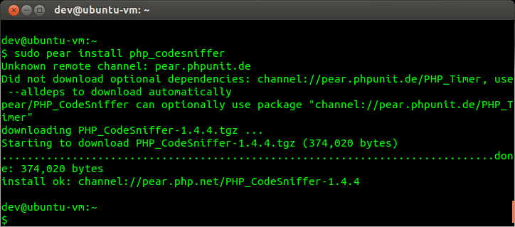
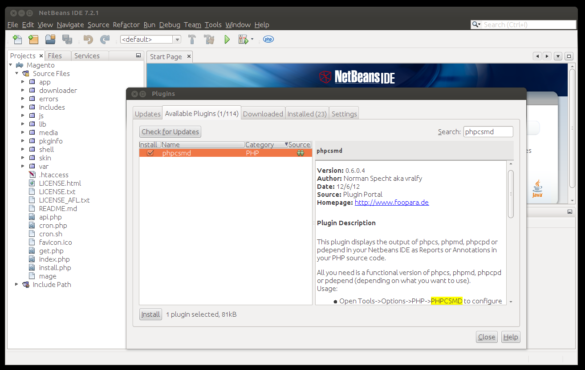
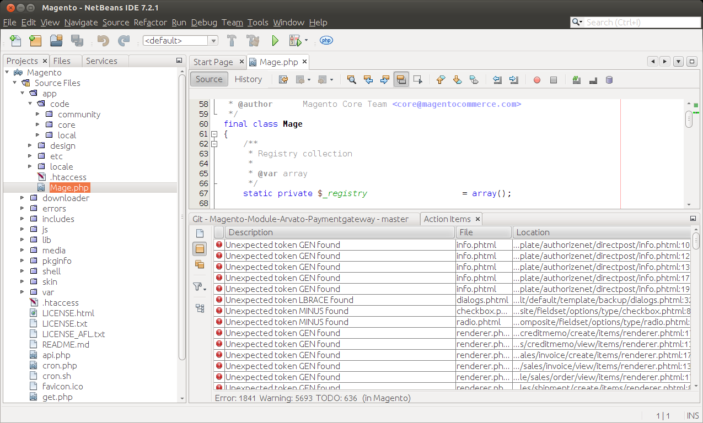
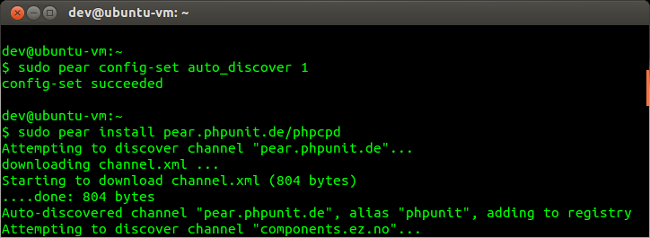
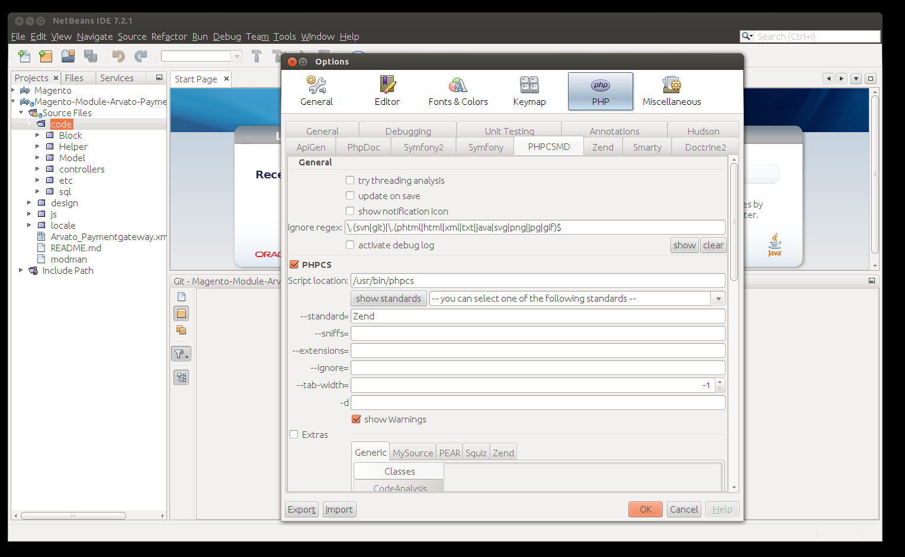
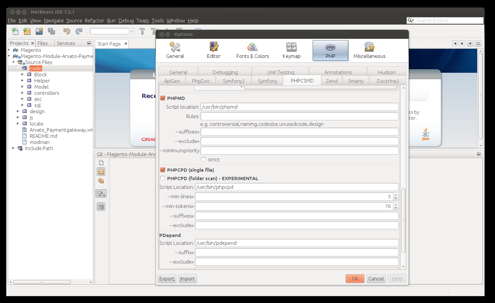
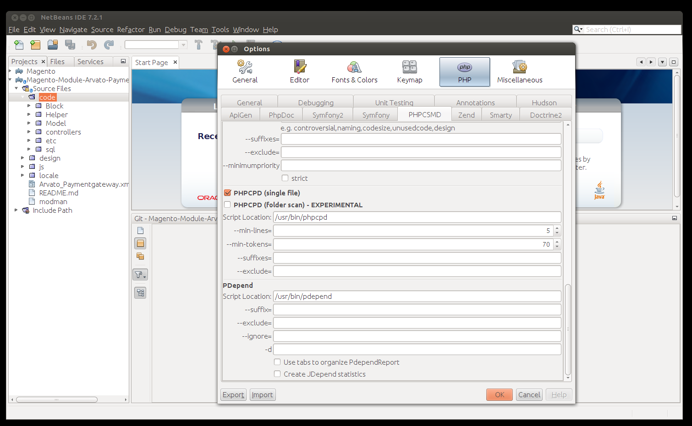

# Code Analysis and Formatting Tools for PHP and Magento

Code analysis and formatting tools for PHP and Magento: PHP CodeSniffer, PHP Mess Detector and PHP Copy Paste Detector in

## PHP CodeSniffer

PHP CodeSniffer tokenises PHP, JavaScript and CSS files and detects violations of a defined set of coding standards.

http://pear.php.net/package/PHP_CodeSniffer/

**Installing PHP CodeSniffer**

Use "pear" to install php_codesniffer:

<!-- language: lang-sh -->

	sudo pear install php_codesniffer

After PHP CodeSniffer has been installed you have to install the rules. For example for Magento you can install [Made.com PHPCS Magento Rules](https://github.com/madedotcom/phpcs-magento-rules):

Get the CodeSniffer installation directory:
<!-- language: lang-sh -->

	pear list-files PHP_CodeSniffer

In my case the the installation folder of PHP-CodeSniffer is:
	
	/usr/share/php/PHP/CodeSniffer

Once you know the installation folder you can clone "phpcs-magento-rules" from github into the "Standards/Made" folder of your CodeSniffer installation:

<!-- language: lang-sh -->

	sudo git clone https://github.com/madedotcom/phpcs-magento-rules /usr/share/php/PHP/CodeSniffer/Standards/Made

You can check if your installation was successfull with the "phpcs -i" command. If the command lists "Made" your installation was successful:

<!-- language: lang-sh -->

	phpcs -i

**Integrating PHP-CodeSniffer with Netbeans**

Integrate PHP-CodeSniffer with Netbeans IDE using [Florian Wolter's phpcsmd plugin for Netbeans](http://blog.florianwolters.de/tutorial/2012/05/03/Integrate-tools-for-static-PHP-code-analyses-into-NetBeans-7.x/):

1. Goto Tools &rarr; Plugins &rarr; Available Plugins
2. Type in "phpcsmd"
3. Check "install" for the plugin with the name "phpcsmd" from Normal Specht
4. Click "install"

After you have installed the "phpcsmd" plugin you can display an "Action Items" window:

Menu &rarr; Window &rarr; Action Items

## PHP Mess Detector

It is a spin-off project of PHP Depend and aims to be a PHP equivalent of the well known Java tool PMD. PHPMD can be seen as an user friendly and easy to configure frontend for the raw metrics measured by PHP Depend.

**Installing PHP Mess Detector**

Use "pear" to install [(]PHP MD - PHP Mess Detector](http://phpmd.org/):

<!-- language: lang-sh -->

	sudo pear channel-discover pear.phpmd.org
	sudo pear channel-discover pear.pdepend.org
	sudo pear install --alldeps phpmd/PHP_PMD

Now you have to download the [Magento ruleset)(https://github.com/cobhimself/phpmd-magento-ruleset) for PHP Mess Detector to your rulesets folder "/usr/share/php/data/PHP_PMD/resources/rulesets".

<!-- language: lang-sh -->

	sudo curl -s -o /usr/share/php/data/PHP_PMD/resources/rulesets/magento-ruleset.xml https://raw.github.com/cobhimself/phpmd-magento-ruleset/master/magento-ruleset.xml

## PHP Copy Paste Detector (PHPCPD)

A Copy/Paste Detector (CPD) for PHP code: https://github.com/sebastianbergmann/phpcpd

**Installing PHP Copy/Paste Detector**

You can install PHPCPD using pear:

<!-- language: lang-sh -->

	sudo pear config-set auto_discover 1
	sudo pear install pear.phpunit.de/phpcpd

## Netbeans Configuration

After you have installed PHP CodeSniffer (PHPCS), PHP Mess Detector (PHPMD) and PHP Copy/Paste Detector (PHPCPD) you should check your Netbeans configuration under

Menu &rarr; Tools &rarr; Options &rarr; PHPCSMD

**PHP CodeSniffer (PHPCS)**

**PHP Mess Detector (PHPMD)**

**PHP Copy/Paste Detector (PHPCPD)**

## Code-Sniffer, Mess-Detector and Copy-Paste Detector in Action

Using PHP-CodeSniffer, PHP-Mess-Detector and PHP-Copy-Paste-Detector in Netbeans:

---

date: 2013-02-26
tags: PHP, Development, Code Analysis, Netbeans
language: en